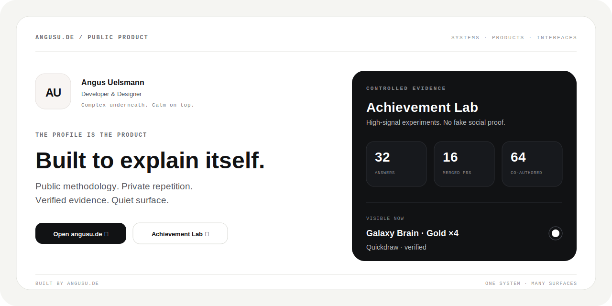

<!-- profile-surface: angusu-editorial-system -->

<p align="center">
  <a href="https://angusu.de">
    
  </a>
</p>

<p align="center">
  <a href="https://angusu.de"></a>
  <a href="https://github.com/angusu-de/achievement-lab"></a>
  <a href="https://github.com/IamAngusU"></a>
</p>

<br>

<table>
  <tr>
    <td width="34%" valign="top">
      <sub>ANGUSU.DE / PUBLIC PRODUCT</sub>
      <h2>One profile.<br>Two layers.</h2>
    </td>
    <td width="66%" valign="top">
      <p><strong>The public layer explains what is being built.</strong><br>
      The private layer absorbs experiments, repetition, and unfinished work.</p>
      <p>What remains is a profile that behaves like the products it presents:
      direct on the surface, deliberate underneath, and honest about how it works.</p>
    </td>
  </tr>
</table>

## Current proof

| Signal | Verified evidence | Profile state |
|---|---:|---|
| Accepted technical answers | **32** | Galaxy Brain **Gold ×4** |
| Authored and merged pull requests | **16** | Checkpoint reached |
| Co-authored commits | **64** | Checkpoint reached |
| Fast issue resolution | **1** | Quickdraw visible |

<sub>Achievement criteria are a GitHub public-preview behavior. Evidence is
measured; badge propagation remains GitHub's decision.</sub>

## The product shelf

<table>
  <tr>
    <td width="50%" valign="top">
      <sub>01 / PUBLIC TOOL</sub>
      <h3>Achievement Lab</h3>
      <p>Reproducible GitHub achievement experiments with a strict repository boundary, real dry-runs, private evidence, public methodology, and no fake social signals.</p>
      <p><a href="https://github.com/angusu-de/achievement-lab"><strong>Open the lab&nbsp;&nbsp;↗</strong></a></p>
    </td>
    <td width="50%" valign="top">
      <sub>02 / LIVING SURFACE</sub>
      <h3>InkWall</h3>
      <p>One visual. One URL. Always current. A shared surface that can evolve while the original link remains unchanged.</p>
      <p><a href="https://angusu.de/inkwall/"><strong>Open InkWall&nbsp;&nbsp;↗</strong></a></p>
    </td>
  </tr>
  <tr>
    <td width="50%" valign="top">
      <sub>03 / WINDOWS TOOLBOX</sub>
      <h3>WinTune</h3>
      <p>A bilingual system toolbox built around recovery, visibility, and practical control instead of unexplained switches.</p>
      <p><a href="https://github.com/IamAngusU/WinTune"><strong>View repository&nbsp;&nbsp;↗</strong></a></p>
    </td>
    <td width="50%" valign="top">
      <sub>04 / BUILDER</sub>
      <h3>IamAngusU</h3>
      <p>The personal account behind the shipped systems, their source code, and this public product layer.</p>
      <p><a href="https://github.com/IamAngusU"><strong>Meet Angus&nbsp;&nbsp;↗</strong></a></p>
    </td>
  </tr>
</table>

## Method

```text
01  Find the real path.
02  Build the smallest complete system.
03  Verify the public result, not the local assumption.
04  Keep the complexity underneath.
```

<details>
  <summary><strong>Why the evidence repository is private</strong></summary>
  <br>
  The reusable runner, safety model, and experiment documentation are public.
  Repetitive branches, discussions, and timestamped artifacts stay in a dedicated
  private repository so the methodology can be inspected without turning the
  product's public history into noise.
</details>

<br>

<table>
  <tr>
    <td width="72" valign="top"><strong>AU</strong></td>
    <td valign="top">
      <strong>Angus Uelsmann</strong><br>
      Developer &amp; Designer<br>
      <code>Systems · Products · Interfaces</code><br><br>
      <sub>Complex underneath. Calm on top.</sub>
    </td>
  </tr>
</table>
