<!-- profile-surface: public-command-deck -->

<p align="center">
  <a href="https://angusu.de">
    
  </a>
</p>

<p align="center">
  <a href="https://angusu.de"></a>
  <a href="https://github.com/IamAngusU"></a>
  <a href="https://github.com/angusu-de/achievement-lab"></a>
</p>

<br>

## This is not a portfolio. It is the control room.

`angusu-de` is the public laboratory behind experiments that are allowed to
look strange, ask uncomfortable product questions, and become real systems.

The polished work lives outside the lab. The evidence, tools, and ideas worth
sharing escape through here.

```text
signal  →  prototype  →  pressure test  →  public surface
   ↑                                          │
   └──────────── learn, rebuild, repeat ──────┘
```

## Live coordinates

<table>
  <tr>
    <td width="50%" valign="top">
      <h3>◈ Achievement Lab</h3>
      <p>A transparent, safety-bounded tool for reproducing GitHub profile-achievement experiments without touching real projects or fabricating social signals.</p>
      <p><a href="https://github.com/angusu-de/achievement-lab"><strong>ENTER THE LAB →</strong></a></p>
    </td>
    <td width="50%" valign="top">
      <h3>◉ InkWall</h3>
      <p>A public message surface where the latest thought replaces the last. Part publishing system, part living interface.</p>
      <p><a href="https://angusu.de/inkwall/"><strong>VIEW THE LIVE SURFACE →</strong></a></p>
    </td>
  </tr>
  <tr>
    <td width="50%" valign="top">
      <h3>⌁ WinTune</h3>
      <p>A bilingual Windows toolbox focused on practical recovery, control, and system visibility instead of mystery buttons.</p>
      <p><a href="https://github.com/IamAngusU/WinTune"><strong>INSPECT THE SYSTEM →</strong></a></p>
    </td>
    <td width="50%" valign="top">
      <h3>◎ The Builder</h3>
      <p>The personal profile, the shipped systems, and the person behind this second identity.</p>
      <p><a href="https://github.com/IamAngusU"><strong>MEET IAMANGUSU →</strong></a></p>
    </td>
  </tr>
</table>

## Operating principles

```yaml
build_for: humans, not screenshots
default_mode: curious but production-minded
ship_when: the real path has been verified
protect: live systems, user data, and the exit door
reject: fake signals, vague magic, silent failure
```

<details>
  <summary><strong>OPEN TRANSMISSION // Why a second identity?</strong></summary>
  <br>
  A lab needs permission to be unfinished. A builder needs a place where the
  strange version can exist before the obvious version arrives. This account is
  that place: public enough to be useful, separate enough to stay fearless.
</details>

<br>

<p align="center">
  <sub>ANGUSU.DE // SYSTEMS IN MOTION // BERLIN TIME</sub><br>
  <strong>Nothing here is finished. Everything here is alive.</strong>
</p>
